# Topic Clusters Architecture: MapMyCareer Geo-Spatial Tech Radar

Topical authority architecture designed under Google’s helpful content framework. Clusters leverage MapMyCareer’s proprietary spatial database (coordinates, metro transit accessibility, tech park campuses, and real-time CTC distributions) to capture high-intent engineering job-seeker queries.

---

## Architecture Overview

```mermaid
graph TD
    MMC[MapMyCareer Root Engine] --> HubNCR[Hub 1: Delhi NCR Tech Corridor]
    MMC --> HubBLR[Hub 2: Bengaluru Tech Corridor]
    MMC --> HubHYD[Hub 3: Hyderabad HITEC Corridor]

    HubNCR --> Spoke1[Spoke 1.1: Cyber City vs Golf Course Ext Commute & CTC]
    HubNCR --> Spoke2[Spoke 1.2: Noida Sector 62 vs 126/135 Tech Hubs]
    HubNCR --> Spoke3[Spoke 1.3: Rapid Metro & Yellow Line Tech Parks]
    HubNCR --> Spoke4[Spoke 1.4: Tier-1 Tech Compensation Guide Gurugram]

    HubBLR --> Spoke5[Spoke 2.1: Outer Ring Road Bellandur-Kadubeesanahalli Bottleneck & Tech Parks]
    HubBLR --> Spoke6[Spoke 2.2: Whitefield EPIP vs Bagmane Tech Park]
    HubBLR --> Spoke7[Spoke 2.3: Namma Metro Purple & Yellow Line Tech Access]
    HubBLR --> Spoke8[Spoke 2.4: Bengaluru Tier-1 SDE Compensation & Tech Parks]

    HubHYD --> Spoke9[Spoke 3.1: HITEC City vs Financial District Nanakramguda]
    HubHYD --> Spoke10[Spoke 3.2: Madhapur Mindspace IT Corridor Guide]
    HubHYD --> Spoke11[Spoke 3.3: Hyderabad Metro Blue Line Tech Park Access]
    HubHYD --> Spoke12[Spoke 3.4: Hyderabad GCCs & SDE-2/3 Compensation Benchmark]
```

---

## Hub 1: Delhi NCR Tech Corridor

- **Seed Keyword:** `Delhi NCR tech corridor jobs and tech parks`
- **Search Intent:** Commercial / Informational (Engineering talent exploring company density, commute radii, and location-tier CTC in Gurugram and Noida).
- **Target URL:** `/corridors/delhi-ncr/`
- **Estimated SERP Difficulty:** Medium (Dominance by generic job boards lacks coordinate-level spatial commute data).
- **Format:** Comprehensive Corridor Pillar with Interactive Spatial Map TOC.
- **Main H2 Sections:**
  1. Spatial Distribution of Tech Clusters: Cyber City, Golf Course Ext, Noida Expressways
  2. Commute Realities: Delhi Metro Yellow Line, Rapid Metro, & Aqua Line Transit Mapping
  3. Tier-1 Product vs IT Services Hub Breakdown
  4. Cost of Living, Rent Radii, and Commute-to-Salary Tradeoffs
  5. Geo-Spatial Job Search: Locating Roles by Campus Coordinates
- **What the Hub Omits:** Granular floor-by-floor campus commute hacks, individual tech park transit step-by-steps, company-specific compensation breakdowns.

---

## Hub 2: Bengaluru Tech Corridor

- **Seed Keyword:** `Bengaluru tech corridor guide tech parks and salaries`
- **Search Intent:** Commercial / Informational (SDEs navigating ORR, Whitefield, and Central Business District hubs).
- **Target URL:** `/corridors/bengaluru/`
- **Estimated SERP Difficulty:** High (Heavily targeted by real estate and generic aggregators; MapMyCareer differentiates via live transit times + verified SDE compensation).
- **Format:** Ultimate Corridor Guide with Geo-Data Embeds.
- **Main H2 Sections:**
  1. The 3 Mega Clusters: Outer Ring Road (ORR), Whitefield, and North Bengaluru
  2. Public Transit vs Shuttle Corridors: Purple Line & Upcoming Metro Expansions
  3. GCC vs Startup Compensation Density by Tech Park
  4. Real-time Commute Impact on Daily Engineering Productivity
  5. MapMyCareer Radar: Pinpointing Bangalore Openings Within 5km Radii
- **What the Hub Omits:** Specific junction micro-bottlenecks (e.g., Silk Board / Marathahalli flyover timing), micro-campus parking walk times.

---

## Hub 3: Hyderabad HITEC Corridor

- **Seed Keyword:** `Hyderabad HITEC city and Financial District tech jobs`
- **Search Intent:** Commercial / Informational (Engineers analyzing Global Capability Centers (GCCs) in Madhapur vs Nanakramguda).
- **Target URL:** `/corridors/hyderabad/`
- **Estimated SERP Difficulty:** Moderate (Low competition on precise tech park transit mapping).
- **Format:** Pillar + Sub-corridor Chapters.
- **Main H2 Sections:**
  1. The Twin Powerhouses: HITEC City Phase 1 & 2 vs Financial District
  2. Hyderabad Metro Blue Line & Raidurg Connectivity Hub
  3. Fortune 500 GCC Density: Microsoft, Google, Amazon, Wells Fargo
  4. Gachibowli to Nanakramguda: Commute Radius and Rent Analysis
  5. Navigating HITEC Careers with Geo-Spatial Filtering
- **What the Hub Omits:** Detailed SDE-3 compensation negotiations per individual GCC, cafeteria/amenity campus comparisons.

---

## 12 High-Intent Spoke Articles

| # | Spoke Title | Target Keyword | Intent | Est. Words | Target URL | Primary Hub Anchor Text |
|---|---|---|---|---|---|---|
| 1 | Cyber City vs Golf Course Extension: Commute & Compensation Analysis | `cyber city vs golf course extension road tech companies` | Commercial / Comparison | 1,800 | `/insights/cyber-city-vs-golf-course-extension` | Delhi NCR Tech Corridor |
| 2 | Noida Sector 62 vs 126/135 Tech Hubs: Transit & Salary Breakdown | `noida sector 62 vs sector 135 it companies commute` | Commercial / Comparison | 1,600 | `/insights/noida-sector-62-vs-135-tech-parks` | Noida Expressway and Sector 62 tech hubs |
| 3 | Delhi Metro Yellow Line & Rapid Metro Tech Parks Guide | `gurugram tech parks metro route yellow line rapid metro` | Informational / Navigational | 1,500 | `/guides/delhi-ncr-metro-tech-park-transit` | Rapid Metro and Yellow Line corridor access |
| 4 | Tier-1 Tech Compensation Guide: Gurugram Tech Hubs | `gurugram software engineer salary by tech park` | Transactional / Commercial | 2,200 | `/compensation/gurugram-tech-parks-salary-benchmarks` | Gurugram software engineering salary benchmarks |
| 5 | Outer Ring Road (ORR) Tech Parks: Commute, Rent & Campus Directory | `outer ring road bangalore tech parks list commute` | Informational / Commercial | 2,400 | `/insights/bangalore-outer-ring-road-tech-parks` | Bengaluru Tech Corridor |
| 6 | Whitefield EPIP vs Bagmane Tech Park: Career Mobility & Tech Stack | `whitefield epip zone vs bagmane tech park companies` | Commercial / Comparison | 1,700 | `/insights/whitefield-vs-bagmane-tech-park` | Whitefield and East Bengaluru tech clusters |
| 7 | Namma Metro Purple & Yellow Line Stations Serving Tech Campuses | `bangalore tech parks near namma metro stations` | Informational / Navigational | 1,500 | `/guides/bangalore-metro-tech-parks-guide` | Namma Metro transit connectivity |
| 8 | Bengaluru Tier-1 SDE Compensation & Tech Park Correlation | `bangalore sde salary by tech park kadubeesanahalli mahadevapura` | Transactional / Commercial | 2,100 | `/compensation/bengaluru-tech-parks-salary-benchmarks` | Bengaluru SDE compensation and tech parks |
| 9 | HITEC City vs Financial District Nanakramguda: Tech Careers Compared | `hitec city vs financial district hyderabad it jobs` | Commercial / Comparison | 1,800 | `/insights/hitec-city-vs-financial-district-hyderabad` | Hyderabad HITEC Corridor |
| 10 | Mindspace IT Park Madhapur: Companies, Gates, Transit & CTC | `mindspace madhapur tech companies list salary commute` | Commercial / Navigational | 1,600 | `/guides/mindspace-madhapur-transit-and-jobs` | Madhapur Mindspace IT Corridor |
| 11 | Hyderabad Metro Blue Line: Direct Access to Raidurg Tech Hubs | `raidurg metro station tech parks distance walk time` | Informational / Navigational | 1,400 | `/guides/hyderabad-blue-line-tech-park-transit` | Hyderabad Metro Blue Line connectivity |
| 12 | Hyderabad GCCs & SDE-2/SDE-3 Compensation Benchmarks | `hyderabad gcc software engineer salary benchmarks` | Transactional / Commercial | 2,000 | `/compensation/hyderabad-gcc-salary-benchmarks` | Hyderabad GCC and tech park compensation |

---

## Internal Linking Architecture & Rules

1. **Upward Authority Flow (Spoke to Hub):**
   - Every spoke article MUST link to its parent Hub within the first 150 words of body text using the designated primary anchor text.
   - Example: In Spoke 1, link `Delhi NCR Tech Corridor` directly to `/corridors/delhi-ncr/`.
2. **Downward Authority Distribution (Hub to Spokes):**
   - The Hub page features a "Micro-Corridor Deep Dives" interactive component linking to all 4 regional spokes.
   - Anchor texts on the hub must match the exact core problem solved (e.g., "Compare Cyber City vs Golf Course Extension transit").
3. **Lateral Contextual Linking (Spoke to Spoke):**
   - Spoke 1 (Cyber City vs GC Ext) links to Spoke 3 (Metro transit) and Spoke 4 (Gurugram salary benchmarks).
   - Spoke 5 (ORR Tech Parks) links to Spoke 7 (Namma metro transit) and Spoke 8 (Bengaluru SDE salary benchmarks).
   - Spoke 9 (HITEC vs Financial Dist) links to Spoke 10 (Mindspace) and Spoke 12 (Hyderabad GCC salary benchmarks).
4. **Direct Conversion Flow to Geo-Spatial Map:**
   - Every spoke and hub features a persistent secondary contextual link to the MapMyCareer dynamic map:
     `Explore live engineering openings across [Cluster Name] on the [MapMyCareer Geo-Spatial Radar](/corridors/[slug]/map).`

---

## Publishing Sequencing Plan

- **Sprint 1 (Spoke Foundation):** Publish Spokes 3, 7, and 11 (Transit & Metro Guides). These rank quickly for low-competition navigational transit queries.
- **Sprint 2 (Salary Benchmarks):** Publish Spokes 4, 8, and 12 (Compensation Benchmarks). These attract initial backlinks from developer communities (Reddit, Blind, Grapevine).
- **Sprint 3 (Pillar Hubs Launch):** Publish Hubs 1, 2, and 3 with full two-way internal links established.
- **Sprint 4 (Corridor Showdowns):** Publish Spokes 1, 2, 5, 6, 9, and 10 to complete the lateral cluster web.
